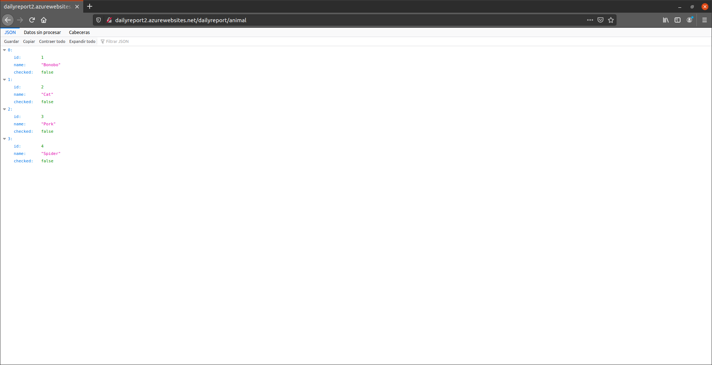

# Avance
{: .d-inline-block }
Nuevo
{: .label .label-purple }

---
Como se ha dicho anteriormente en [Prueba del sistema](https://guillergood.github.io/DailyReport-2.0/docs/Testeo.html)

Se ha visto que en el peor de los casos el sistema tiene una velocidad media de 4ms. Y la mejor de 1ms.

Se ha deplegado el proyecto en la nube, concretamente en Azure, siguiendo este [tutorial](https://docs.microsoft.com/es-es/azure/app-service/tutorial-multi-container-app)

Esta es la captura de pantalla de la configuración final, después de seguir la guía anterior.