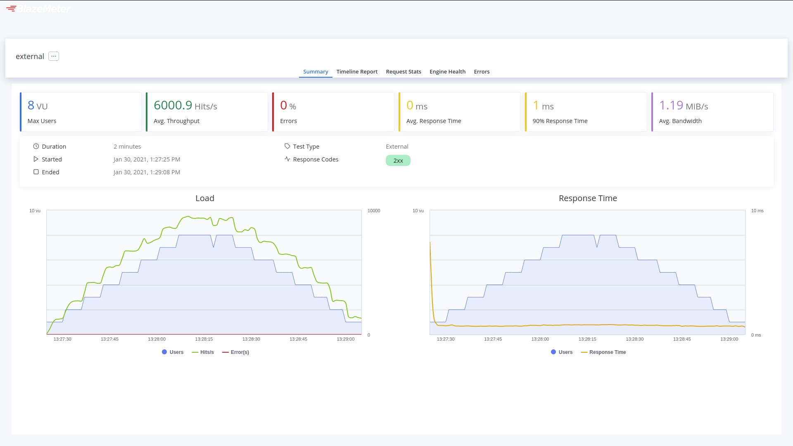
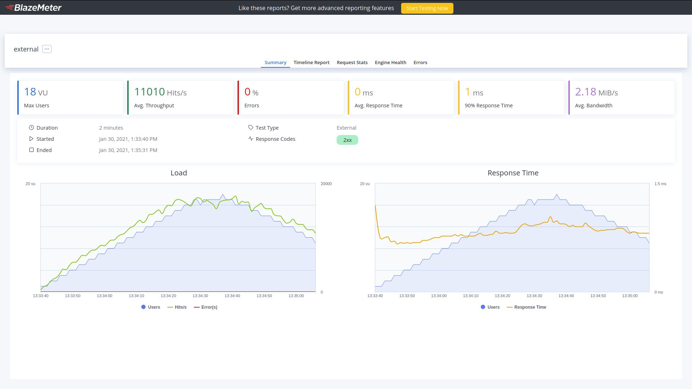
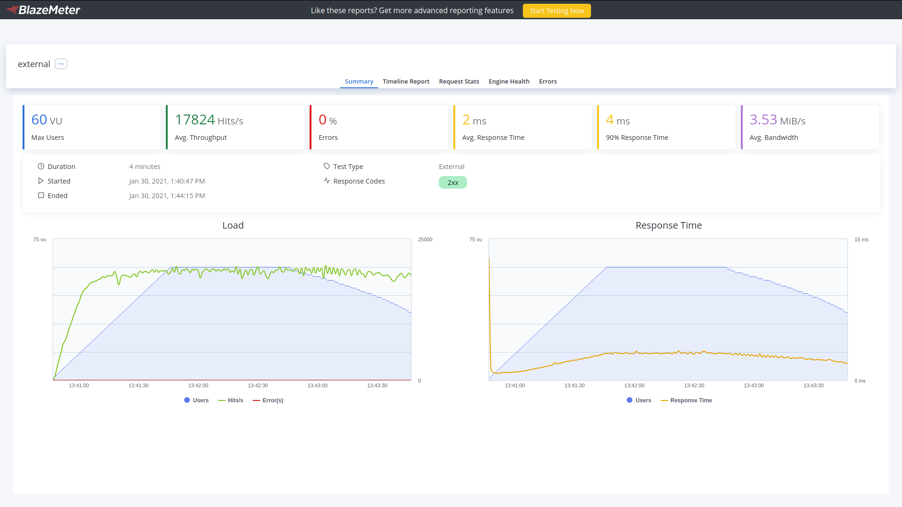
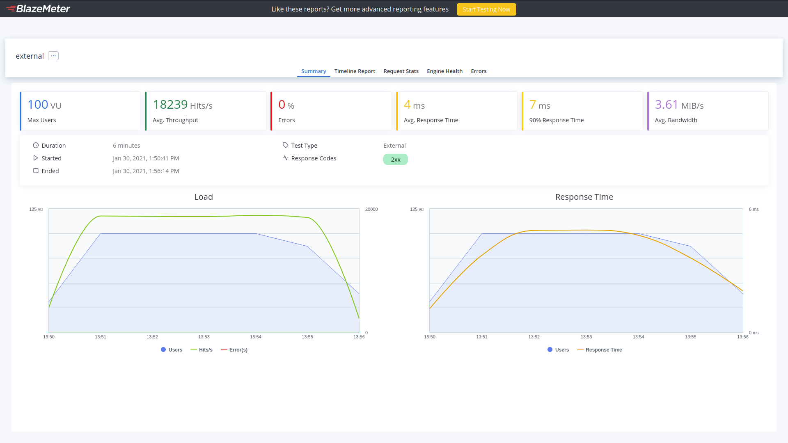

# Prueba del sistema.

{: .d-inline-block }
Nuevo
{: .label .label-purple }


---

Para probar el sistema, localmente se ha desplegado y visto que funcionaba el proyecto, se probó a hacer un test de carga para comprobar su velocidad, posibles errores y límites.
Cuyos párametros inciales fueron los siguientes, cambiando los usuarios concurrentes únicamente.


[Prueba de 10 usuarios concurrentes](https://a.blazemeter.com/app/?public-token=9d6MLNR5J1ZRVAgF0kXmnvCcoA1KJwYpFtee9mdnTQbXWkxEOq#/accounts/-1/workspaces/-1/projects/-1/sessions/r-ext-601550abe4f3e/summary/summary)

```yaml
  concurrency: 10
  ramp-up: 1m
  iterations: 10000
  scenario: simple
```


[Prueba de 20 usuarios concurrentes](https://a.blazemeter.com/app/?public-token=baGtmdk8zkskOTZK6GhghLbmSLQKYB88KbPZ5blKStFeW0ANSb#/accounts/-1/workspaces/-1/projects/-1/sessions/r-ext-60155222ce044/summary/summary)

```yaml
  concurrency: 20
  ramp-up: 1m
  iterations: 10000
  scenario: simple
```



[Prueba de 40 usuarios concurrentes](https://a.blazemeter.com/app/?public-token=dhevT6WJ3oVu6O4lG5QFwPVr8lhX3JyrQrdLdjqgDr6H3pUHLP#/accounts/-1/workspaces/-1/projects/-1/sessions/r-ext-6015530a36e44/summary/summary)

```yaml
  concurrency: 40
  ramp-up: 1m
  iterations: 10000
  scenario: simple
```


[Prueba de 60 usuarios concurrentes](https://a.blazemeter.com/app/?public-token=fzDniI0zP0jjL4bgLOdnl0w5RZKFbQYS5Bqfk7uMBg2p1Awp8c#/accounts/-1/workspaces/-1/projects/-1/sessions/r-ext-601553ce3ab10/summary/summary)

```yaml
  concurrency: 60
  ramp-up: 1m
  iterations: 10000
  scenario: simple
```


[Prueba de 80 usuarios concurrentes](https://a.blazemeter.com/app/?public-token=kgBNv4LIOU5LsjZdkwA3v5EGWbpJlcApamsr7X1n0eSzm5RtYS#/accounts/-1/workspaces/-1/projects/-1/sessions/r-ext-601554cac26d1/summary/summary)

```yaml
  concurrency: 80
  ramp-up: 1m
  iterations: 10000
  scenario: simple
```


[Prueba de 100 usuarios concurrentes](https://a.blazemeter.com/app/?public-token=T4jLBTLBBP8qz7NrCIQDoVeNm24zB4hwdiPJJXFnVBeXgfBJed#/accounts/-1/workspaces/-1/projects/-1/sessions/r-ext-6015561fec633/summary/summary)

```yaml
  concurrency: 100
  ramp-up: 1m
  iterations: 10000
  scenario: simple
```


Las conclusiones son que el proyecto se mantiene bastante estable con cargas pesadas y haciendo diversas peticiones, permitiendo dar un servicio mejor del esperado. Con cerca de 18500 hits/s, sin ningún error y en el peor de los casos una respuesta media de 4ms con 3 MiB/s de ancho de banda.
Por último se deja tanto el fichero de prueba de carga:
```yaml
execution:
  - concurrency: 10
    ramp-up: 1m
    iterations: 10000
    #hold-for: 1m30s
    scenario: simple

scenarios:
  simple:
    requests:
      #######################################################################
      #                                 ANIMAL                              #
      #######################################################################
      #                           LLAMADAS POST ANIMAL                      #
      #######################################################################
      - url: http://0.0.0.0:8080/dailyreport/animal
        method: POST
        label: "POST Animal"
        headers:
          Content-Type: application/json
        body: '{"id":1,"name":"Bonobo","checked":false}'


      #######################################################################
      #                        LLAMADAS PUT ANIMAL                          #
      #######################################################################

      - once:
          - url: http://0.0.0.0:8080/dailyreport/animal/1
            method: PUT
            label: "PUT Animal /dailyreport/animal/1"
            headers:
              Content-Type: application/json
            body: '{"id":1,"name":"Bonobo","checked":true}'


      #######################################################################
      #                        LLAMADAS DELETE ANIMAL                       #
      #######################################################################

      - once:
          - url: http://0.0.0.0:8080/dailyreport/animal/1
            method: DELETE
            label: "DELETE Animal"
          - url: http://0.0.0.0:8080/dailyreport/animal
            method: POST
            label: "REESTABLECER Animal después del DELETE"
            headers:
              Content-Type: application/json
            body: '{"id":1,"name":"Bonobo","checked":false}'

      #######################################################################
      #                               CUIDADOR                              #
      #######################################################################
      #                        LLAMADAS POST CUIDADOR                       #
      #######################################################################

      - url: http://0.0.0.0:8080/dailyreport/cuidador
        method: POST
        label: "POST Cuidador"
        headers:
          Content-Type: application/json
        body: '{"id":1,"name":"Alan"}'

      #######################################################################
      #                        LLAMADAS PUT CUIDADOR                        #
      #######################################################################

      - once:
          - url: http://0.0.0.0:8080/dailyreport/cuidador/1
            method: PUT
            label: "PUT Cuidador /dailyreport/cuidador/1"
            headers:
              Content-Type: application/json
            body: '{"id":1,"name":"Helen"}'


      #######################################################################
      #                        LLAMADAS DELETE CUIDADOR                     #
      #######################################################################

      - once:
          - url: http://0.0.0.0:8080/dailyreport/cuidador/1
            label: "DELETE Cuidador /dailyreport/cuidador/1"
            method: DELETE
          - url: http://0.0.0.0:8080/dailyreport/cuidador
            label: "REESTABLECER Cuidador después del DELETE"
            method: POST
            headers:
              Content-Type: application/json
            body: '{"id":1,"name":"Alan"}'


      #######################################################################
      #                               REPORT                                #
      #######################################################################
      #                        LLAMADAS POST REPORT                         #
      #######################################################################

      - url: http://0.0.0.0:8080/dailyreport/report
        method: POST
        label: "POST Report"
        headers:
          Content-Type: application/json
        body: '{"id":1,"keeperName":"Alan","animalName":"Bonobo","report":"hello"}'


      #######################################################################
      #                        LLAMADAS PUT REPORT                          #
      #######################################################################

      - once:
          - url: http://0.0.0.0:8080/dailyreport/report/1
            method: PUT
            label: "PUT Report /dailyreport/report/1"
            headers:
              Content-Type: application/json
            body: '{"id":1,"keeperName":"Helen","animalName":"Bonobo","report":"hello"}'

      #######################################################################
      #                        LLAMADAS DELETE REPORT                       #
      #######################################################################

      - once:
          - url: http://0.0.0.0:8080/dailyreport/report/1
            method: DELETE
            label: "DELETE Report /dailyreport/report/1"
          - url: http://0.0.0.0:8080/dailyreport/report
            method: POST
            label: "REESTABLECER Report después del DELETE"
            headers:
              Content-Type: application/json
            body: '{"id":1,"keeperName":"Alan","animalName":"Bonobo","report":"hello"}'

      #######################################################################
      #                        LLAMADAS GET                                 #
      #######################################################################


      - url: http://0.0.0.0:8080/dailyreport/animal
        method: GET
        label: "GET todos los animales"
      - url: http://0.0.0.0:8080/dailyreport/report
        method: GET
        label: "GET todos los reports"
      - url: http://0.0.0.0:8080/dailyreport/cuidador
        method: GET
        label: "GET todos los cuidadores"

reporting:
  - module: final-stats
    dump-xml: stats.xml
  - module: passfail
    criteria:
      - success<100%, continue as failed
      - avg-rt>500ms, stop as failed
      - avg-ct>500ms, stop as failed
  - module: blazemeter
    token: ${TAURUS_TOKEN}
    report-name: DailyReport-2.0
    test: DailyReport performance test
    project: Taurus Tests Group
    upload-artifacts: true  # upload artifacts when test is finished
```
